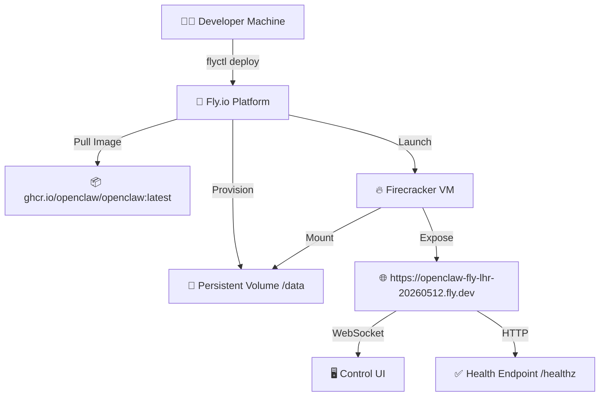
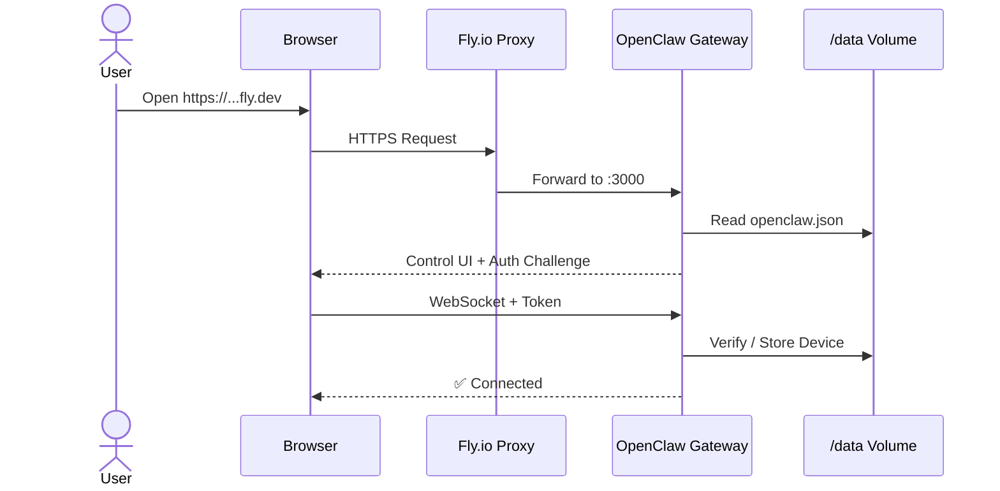
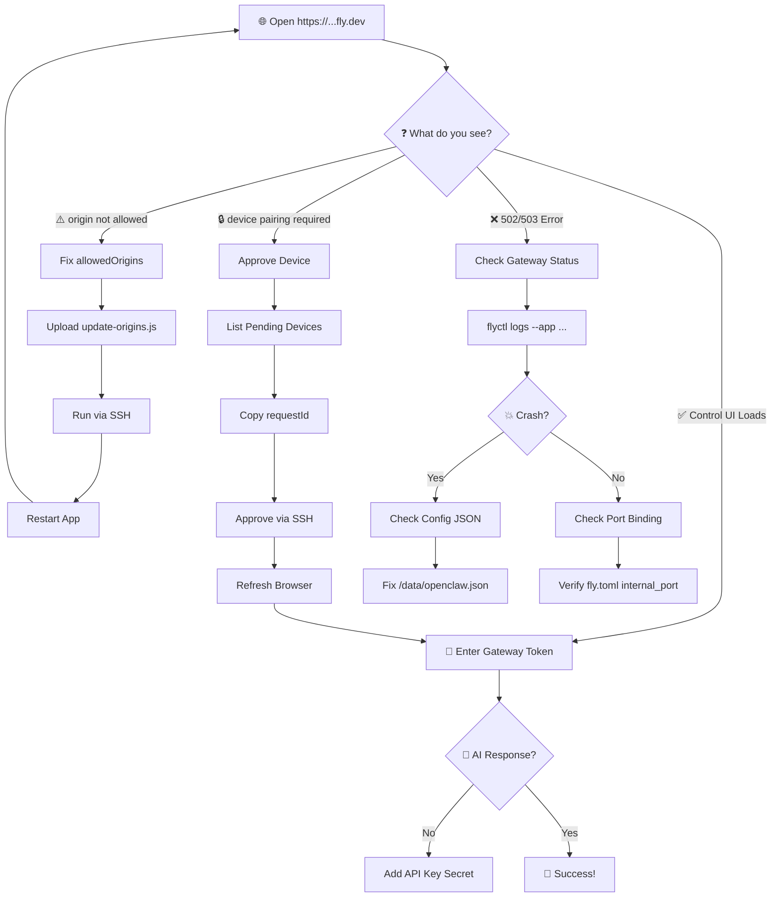

# 🦞 OpenClaw on Fly.io

> Your personal AI assistant, deployed to the cloud.

---

## 📋 Table of Contents

- [Overview](#overview)
- [Architecture](#architecture)
- [Quick Start](#quick-start)
- [Full Setup Guide](#full-setup-guide)
- [Diagnosis & Troubleshooting](#diagnosis--troubleshooting)
- [Security Notes](#security-notes)
- [References](#references)

---

## 🎯 Overview

This repository deploys the official [**OpenClaw**](https://github.com/openclaw/openclaw) AI assistant to [Fly.io](https://fly.io) using the pre-built Docker image from GitHub Container Registry.

| Property | Value |
|----------|-------|
| **App Name** | `openclaw-fly-lhr-20260512` |
| **Public URL** | `https://openclaw-fly-lhr-20260512.fly.dev` |
| **Health Check** | `https://openclaw-fly-lhr-20260512.fly.dev/healthz` |
| **Region** | `lhr` (London) |
| **Image** | `ghcr.io/openclaw/openclaw:latest` |
| **VM** | `shared-cpu-2x` / 2048 MB RAM |
| **Volume** | `openclaw_data` (1 GB, encrypted) |

---

## 🏗️ Architecture

### Deployment Flow



### Request Lifecycle



---

## 🚀 Quick Start

### Prerequisites

| Tool | Check Command |
|------|--------------|
| Fly CLI | `flyctl version` |
| Fly Auth | `flyctl auth whoami` |
| Docker | `docker --version` |
| Git | `git --version` |

### 1️⃣ Clone & Configure

```bash
git clone https://github.com/rifaterdemsahin/openclaw.git
cd openclaw
```

### 2️⃣ Create the Fly.io App

```bash
flyctl apps create openclaw-fly-lhr-20260512 --org personal -y
```

### 3️⃣ Create Persistent Volume

```bash
flyctl volumes create openclaw_data --region lhr --size 1 --app openclaw-fly-lhr-20260512 -y
```

### 4️⃣ Set Secrets

> ⚠️ **Never commit secrets to git!** Store them in Azure Key Vault or Fly.io secrets.

Generate a gateway token:
```bash
openssl rand -hex 32
```

Set it on Fly.io:
```bash
flyctl secrets set OPENCLAW_GATEWAY_TOKEN=<YOUR_TOKEN> --app openclaw-fly-lhr-20260512
```

Save to Azure Key Vault:
```bash
az keyvault secret set --vault-name openshifthelper --name OpenClawGatewayToken --value <YOUR_TOKEN>
```

### 5️⃣ Deploy

```bash
flyctl deploy --app openclaw-fly-lhr-20260512
```

### 6️⃣ Verify

```bash
curl -I https://openclaw-fly-lhr-20260512.fly.dev/healthz
# Expected: HTTP/1.1 200 OK
```

---

## 🔧 Full Setup Guide

### Phase 1: Codebase Inspection ✅

We identified:
- **Framework**: Node.js 24 (OpenClaw Gateway)
- **Image**: `ghcr.io/openclaw/openclaw:latest`
- **Port**: `3000` (internal)
- **Entrypoint**: `node dist/index.js gateway --allow-unconfigured --port 3000 --bind lan`
- **Health**: `/healthz`, `/readyz`

### Phase 2: Fly.toml Configuration

```toml
app = "openclaw-fly-lhr-20260512"
primary_region = "lhr"

[build]
image = "ghcr.io/openclaw/openclaw:latest"

[env]
NODE_ENV = "production"
OPENCLAW_PREFER_PNPM = "1"
OPENCLAW_STATE_DIR = "/data"
NODE_OPTIONS = "--max-old-space-size=1536"

[processes]
app = "node dist/index.js gateway --allow-unconfigured --port 3000 --bind lan"

[http_service]
internal_port = 3000
force_https = true
auto_stop_machines = false
auto_start_machines = true
min_machines_running = 1
processes = ["app"]

[[vm]]
size = "shared-cpu-2x"
memory = "2048mb"

[mounts]
source = "openclaw_data"
destination = "/data"
```

### Phase 3: Post-Deploy Configuration

After first deploy, the Control UI needs two fixes:

#### 🔧 Fix 1: Allow Fly.io Origin

The default `allowedOrigins` only includes `localhost`. Add the Fly.io URL:

```bash
# Upload fix script
flyctl ssh sftp put --app openclaw-fly-lhr-20260512 update-origins.js /home/node/update-origins.js

# Run it
flyctl ssh console --app openclaw-fly-lhr-20260512 --command "node /home/node/update-origins.js"
```

Script content (`update-origins.js`):
```javascript
const fs = require('fs');
const path = '/data/openclaw.json';
const cfg = JSON.parse(fs.readFileSync(path, 'utf8'));
cfg.gateway = cfg.gateway || {};
cfg.gateway.controlUi = cfg.gateway.controlUi || {};
cfg.gateway.controlUi.allowedOrigins = [
  'http://localhost:3000',
  'http://127.0.0.1:3000',
  'https://openclaw-fly-lhr-20260512.fly.dev'
];
fs.writeFileSync(path, JSON.stringify(cfg, null, 2));
console.log('Updated allowedOrigins');
```

#### 🔧 Fix 2: Device Pairing

OpenClaw requires explicit device approval for security. When you open the Control UI from a new browser, you'll see:

> **device pairing required (requestId: xxxxxxxx-xxxx-xxxx-xxxx-xxxxxxxxxxxx)**

**The Problem:** The CLI `devices approve` command fails on Fly.io because the CLI connection itself is treated as a new device that also needs pairing (chicken-and-egg problem).

**The Solution:** Directly manipulate the device pairing database files on the persistent volume.

**Step 1:** Find the pending device
```bash
flyctl ssh console --app openclaw-fly-lhr-20260512 --command "cat /data/devices/pending.json"
```

**Step 2:** Create an approval script (`approve-device.js`):
```javascript
const fs = require('fs');
const path = require('path');
const crypto = require('crypto');

const devicesDir = '/data/devices';
const pendingPath = path.join(devicesDir, 'pending.json');
const pairedPath = path.join(devicesDir, 'paired.json');

const requestId = 'YOUR_REQUEST_ID_HERE';

const pending = JSON.parse(fs.readFileSync(pendingPath, 'utf8'));
const paired = JSON.parse(fs.readFileSync(pairedPath, 'utf8'));

if (!pending[requestId]) {
  console.log('Device not found in pending');
  process.exit(1);
}

const device = pending[requestId];
const now = Date.now();

const pairedEntry = {
  deviceId: device.deviceId,
  publicKey: device.publicKey,
  platform: device.platform,
  clientId: device.clientId,
  clientMode: device.clientMode,
  role: device.role,
  roles: device.roles,
  scopes: device.scopes,
  approvedScopes: device.scopes,
  tokens: {
    operator: {
      token: crypto.randomBytes(32).toString('base64url'),
      role: 'operator',
      scopes: device.scopes,
      createdAtMs: now
    }
  },
  createdAtMs: now,
  approvedAtMs: now
};

paired[device.deviceId] = pairedEntry;
delete pending[requestId];

fs.writeFileSync(pairedPath, JSON.stringify(paired, null, 2));
fs.writeFileSync(pendingPath, JSON.stringify(pending, null, 2));
console.log('Approved device ' + requestId);
```

**Step 3:** Upload and run the script
```bash
flyctl ssh sftp put --app openclaw-fly-lhr-20260512 approve-device.js /home/node/approve-device.js
flyctl ssh console --app openclaw-fly-lhr-20260512 --command "node /home/node/approve-device.js"
```

**Step 4:** Refresh your browser — the device is now approved!

> 📄 **See full report:** [DEVICE_PAIRING_FIX.md](DEVICE_PAIRING_FIX.md)

### Phase 4: Add AI Provider

Set an API key (e.g., OpenAI) via Fly secrets:
```bash
flyctl secrets set OPENAI_API_KEY=sk-... --app openclaw-fly-lhr-20260512
```

Or configure via the Control UI dashboard.

---

## 🔍 Diagnosis & Troubleshooting

### Diagnosis Flowchart



### Common Errors

| Error | Cause | Fix |
|-------|-------|-----|
| ⚠️ `origin not allowed` | Fly.io URL missing from `allowedOrigins` | Run `update-origins.js` script via SSH |
| 🔒 `device pairing required` | Browser not approved as trusted device | Direct database fix: modify `/data/devices/pending.json` and `/data/devices/paired.json` via Node.js script. See [Fix 2: Device Pairing](#-fix-2-device-pairing) above. |
| ❌ `GatewayTransportError: 1006` | CLI connecting to wrong port | `export OPENCLAW_GATEWAY_URL=ws://127.0.0.1:3000` |
| 💥 `Invalid config at /data/openclaw.json` | Bad config key (e.g., `devicePairing`) | Destroy volume & recreate, or fix JSON |
| 🔄 `app not listening on expected address` | Gateway still booting | Wait 10s, verify with `curl /healthz` |
| 🚫 `401/403 Unauthorized` | Missing or wrong `OPENCLAW_GATEWAY_TOKEN` | `flyctl secrets set OPENCLAW_GATEWAY_TOKEN=...` |

### Useful Commands

```bash
# 📊 Check status
flyctl status --app openclaw-fly-lhr-20260512

# 📜 Stream logs
flyctl logs --app openclaw-fly-lhr-20260512

# 🔍 Check recent logs (no tail)
flyctl logs --app openclaw-fly-lhr-20260512 --no-tail

# 🔐 List secrets
flyctl secrets list --app openclaw-fly-lhr-20260512

# 💻 SSH into machine
flyctl ssh console --app openclaw-fly-lhr-20260512

# 📁 Check config file
flyctl ssh console --app openclaw-fly-lhr-20260512 --command "cat /data/openclaw.json"

# 🔄 Restart app
flyctl apps restart openclaw-fly-lhr-20260512

# 📦 Scale up
flyctl scale count 2 --app openclaw-fly-lhr-20260512
flyctl scale vm shared-cpu-2x --memory 4096 --app openclaw-fly-lhr-20260512

# ⏪ Rollback
flyctl releases --app openclaw-fly-lhr-20260512
flyctl rollback <version> --app openclaw-fly-lhr-20260512
```

---

## 🔒 Security Notes

> ⚠️ **Critical: Never commit secrets to git!**

- **Tokens**: Store in Azure Key Vault (`openshifthelper`) or Fly.io secrets
- **Config Files**: Never include real credentials in `fly.toml`, `DEPLOYMENT.md`, or `README.md`
- **Placeholders**: Use `<TOKEN>` or `<API_KEY>` in all committed documentation
- **Device Pairing**: This is a security feature. Every new browser/device must be approved before accessing the Control UI
- **Gateway Token**: Required when binding to non-loopback addresses. Auto-generated if not set

---

## 📚 References

- 🦞 [OpenClaw GitHub](https://github.com/openclaw/openclaw)
- 📖 [OpenClaw Docker Docs](https://docs.openclaw.ai/install/docker)
- ✈️ [Fly.io Docs](https://fly.io/docs/)
- 📄 [DEPLOYMENT.md](DEPLOYMENT.md) — Detailed deployment log
- 🤖 [AGENTS.md](AGENTS.md) — Agent coding guidelines

---

## 🎉 Success Checklist

- [ ] App deployed and accessible at `https://openclaw-fly-lhr-20260512.fly.dev`
- [ ] Health endpoint returns `200 OK`
- [ ] `allowedOrigins` includes Fly.io URL
- [ ] Device pairing approved for your browser
- [ ] Gateway Token stored securely (Key Vault + Fly secrets)
- [ ] AI provider API key configured
- [ ] No secrets committed to git

**Happy AI assisting!** 🦞✨
